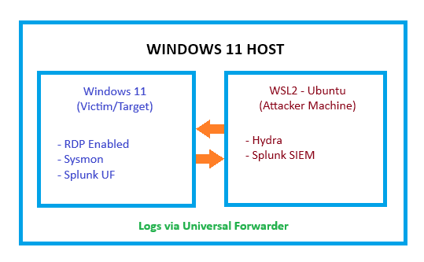
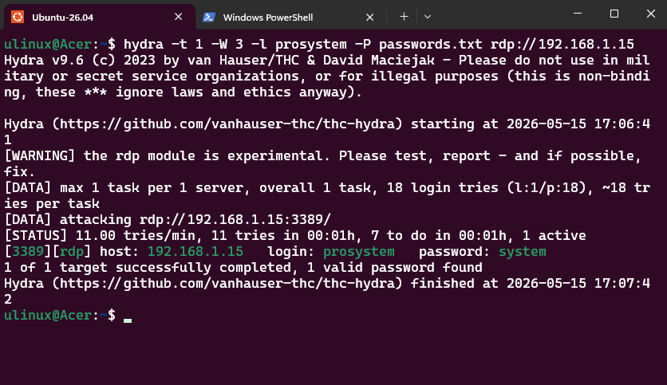
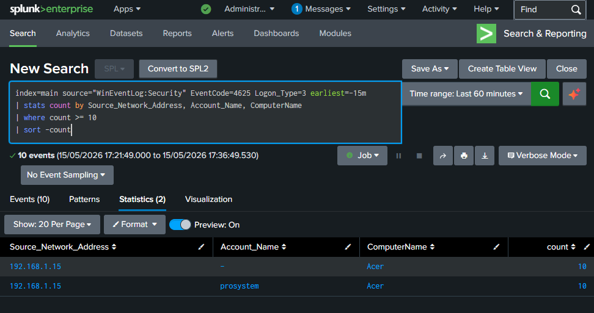
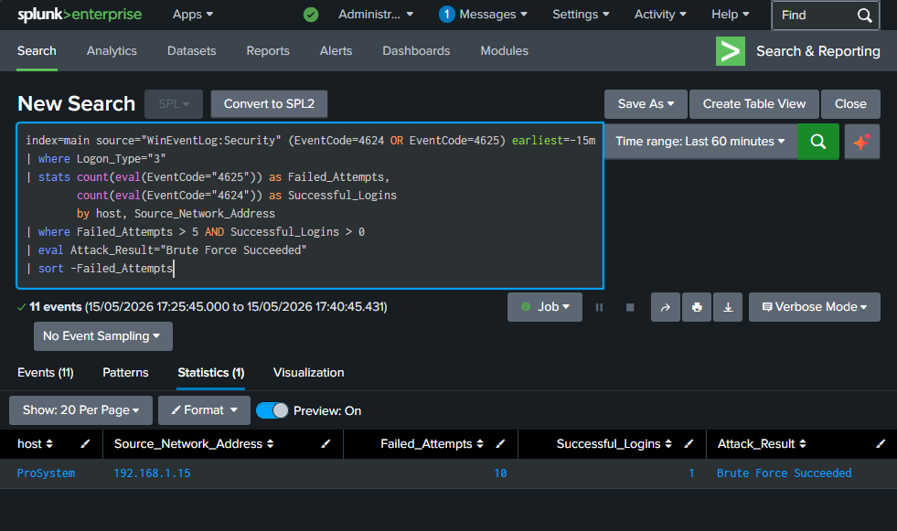
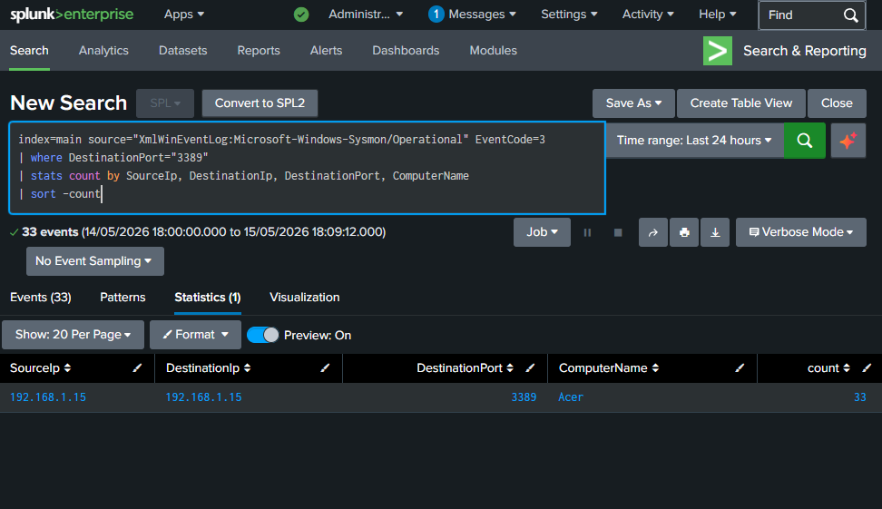
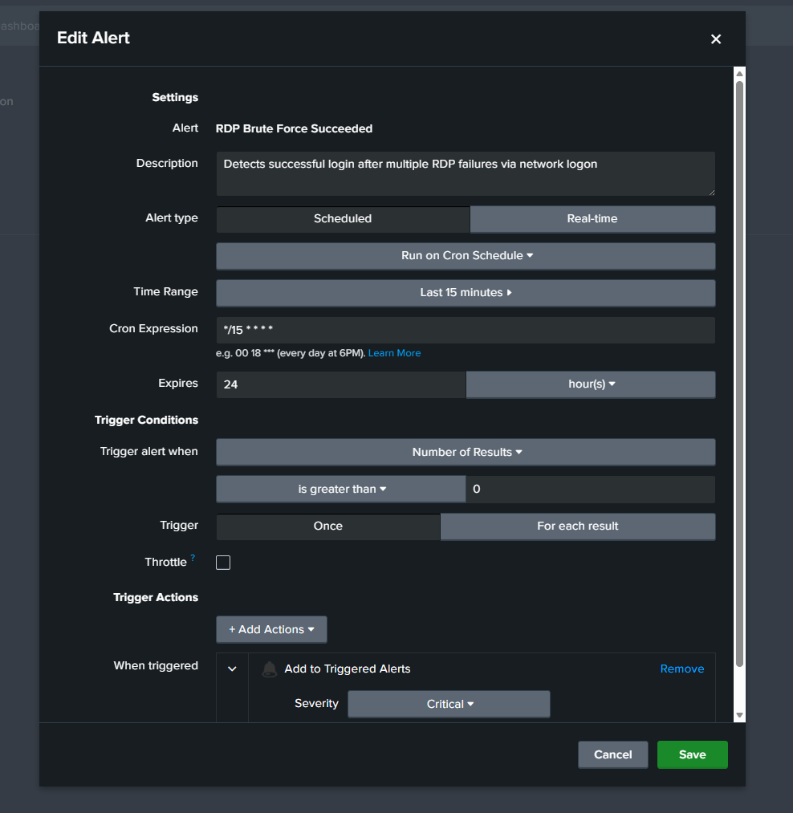
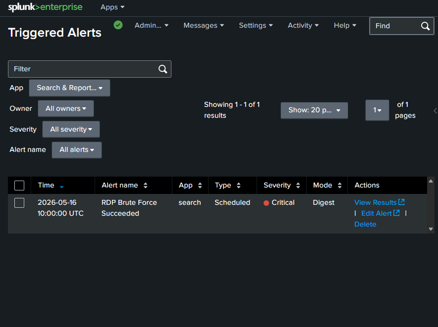

# Windows RDP Brute Force Detection using Splunk & Sysmon

I built this project to get hands-on experience with attack detection. I simulated an RDP brute force attack on my own Windows 11 machine and then used Splunk to detect it. The idea was simple - do the attack myself, then figure out how to catch it.

---

## Why I Built This

I want to become a SOC Analyst and I felt like just watching videos wasn't enough. RDP brute force is something that happens a lot in real environments so I thought this would be a good starting point. I set everything up on my own machine, ran the attack, collected the logs and wrote SPL queries to detect what happened.

---

## Lab Setup

I didn't use any cloud or extra machine. Everything runs on my single Windows 11 laptop.

<p align="center">
  <br>
  <sub>Lab Setup</sub>
</p>

**Components:**

| Component | Role | Where |
|---|---|---|
| Windows 11 | Victim / Log Source | Host Machine |
| Sysmon | Detailed event logging | Windows 11 |
| Splunk Universal Forwarder | Sends logs to Splunk | Windows 11 |
| WSL2 Ubuntu | Attacker machine + Splunk host | Host Machine |
| Hydra | RDP brute force tool | WSL2 Ubuntu |
| Splunk (Free) | SIEM - for detection and alerting | WSL2 Ubuntu |

---

## Log Sources

I configured two log sources to forward to Splunk:

**1. Windows Security Event Log**
- Event ID `4625` - Failed login
- Event ID `4624` - Successful login
- Logon Type `3` - Network login (this is what RDP brute force generates)

**2. Sysmon Operational Log**
- Event ID `3` - Network connection (I used this to monitor port 3389)
- Event ID `1` - Process creation

I used [sysmon-config](https://github.com/SwiftOnSecurity/sysmon-config) by SwiftOnSecurity as the base config for Sysmon.

---

## Attack Simulation

I ran Hydra from my WSL2 Ubuntu terminal to brute force RDP on my Windows 11 machine.

```bash
hydra -t 1 -W 3 -l prosystem -P passwords.txt rdp://192.168.1.15
```

**What each flag does:**
- `-t 1` - 1 thread only because RDP doesn't work well with multiple threads
- `-W 3` - 3 second wait between each attempt
- `-l prosystem` - the username I was targeting
- `-P passwords.txt` - my password wordlist
- `rdp://192.168.1.15` - my Windows 11 machine IP

Hydra went through the wordlist, failed a bunch of times and then got in when it hit the right password. All of this showed up in Splunk.

<p align="center">
  <br>
  <sub>Hydra Attack Running</sub>
</p>

---

## Detection - SPL Queries
> ⚠️ **Note:** In this lab the attacker IP and victim IP appear the same in Splunk logs because I ran the attack from WSL2 Ubuntu which shares the network interface with the host Windows 11 machine. In a real environment the attacker would be on a completely separate machine so the source and destination IPs would always be different.
### Query 1: Detecting the Brute Force (Failed Logins)

This query looks for any IP that failed to login more than 10 times. I added `Logon_Type=3` to filter only network logins because that's what Hydra generates - without this filter you get a lot of noise from local logins too.

```spl
index=main source="WinEventLog:Security" EventCode=4625 Logon_Type=3 earliest=-15m
| stats count by Source_Network_Address, Account_Name, ComputerName
| where count >= 10
| sort -count
```

<p align="center">
  <br>
  <sub>Failed Login Detection in Splunk</sub>
</p>

---

### Query 2: Checking if Brute Force was Successful

This is the main query. I combined both failed and successful login events in one search and used `eval` inside `stats` to count them separately. If the same IP has 10 or more failures and at least one success - the brute force worked.

```spl
index=main source="WinEventLog:Security" (EventCode=4624 OR EventCode=4625)
| where Logon_Type="3"
| stats count(eval(EventCode="4625")) as Failed_Attempts,
        count(eval(EventCode="4624")) as Successful_Logins
        by host, Source_Network_Address
| where Failed_Attempts >= 10 AND Successful_Logins > 0
| eval Attack_Result="Brute Force Succeeded"
| sort -Failed_Attempts
```

<p align="center">
  <br>
  <sub>Successful Brute Force Detection</sub>
</p>

---

### Query 3: Sysmon - Monitoring Port 3389 Connections

Windows Security logs don't always show clean source IP data. Sysmon Event ID 3 logs every network connection so I used it to track all connections hitting port 3389.

```spl
index=main source="XmlWinEventLog:Microsoft-Windows-Sysmon/Operational" EventCode=3
| where DestinationPort="3389"
| stats count by SourceIp, DestinationIp, DestinationPort, ComputerName
| sort -count
```

<p align="center">
  <br>
  <sub>RDP Port 3389 Connection Monitoring</sub>
</p>

---

## Alert Setup

Once the queries were working I set up a Splunk alert on Query 2 so it runs automatically and I don't have to manually search every time.

**Alert Configuration:**

| Field | Value |
|---|---|
| Title | RDP Brute Force Succeeded |
| Description | Detects successful login after multiple RDP failures via network logon |
| Alert Type | Scheduled |
| Time Range | Last 15 minutes |
| Cron Schedule | `*/15 * * * *` |
| Expires | 24 hours |
| Trigger Condition | Number of Results greater than 0 |
| Trigger | For each result |
| Severity | Critical |
| Action | Add to Triggered Alerts |

<p align="center">
  <br>
  <sub>Alert Configuration in Splunk</sub>
</p>

Every 15 minutes Splunk checks if any IP had more than 10 failed logins and at least one successful login in the same window. If yes - the alert fires and shows up under Activity → Triggered Alerts.

**How to verify the alert worked:**
1. Run the Hydra attack from WSL2 Ubuntu
2. Wait for the cron cycle to finish (up to 15 minutes)
3. Go to Splunk → **Activity → Triggered Alerts**
4. "RDP Brute Force Succeeded" will show up there with a timestamp and result count

<p align="center">
  <br>
  <sub>Triggered Alert in Splunk</sub>
</p>

> ⚠️**Note:** I kept the alert as **Scheduled** because that's how most SOC teams set it up in production - it uses less resources. If you want it to fire immediately when brute force is detected, just change **Alert Type** to **Real-time** in the alert settings.

---

## MITRE ATT&CK Mapping

| Tactic | Technique | ID | Description |
|---|---|---|---|
| Credential Access | Brute Force | [T1110](https://attack.mitre.org/techniques/T1110/) | Used Hydra to guess RDP passwords from a wordlist |
| Credential Access | Password Guessing | [T1110.001](https://attack.mitre.org/techniques/T1110/001/) | Targeted a single account with multiple password attempts |
| Initial Access | Remote Services: RDP | [T1021.001](https://attack.mitre.org/techniques/T1021/001/) | Got in through RDP after brute force succeeded |
| Initial Access | Exploit Public-Facing Application | [T1190](https://attack.mitre.org/techniques/T1190/) | Port 3389 was open and directly targeted |

**Attack Chain:**

```
Reconnaissance    →  Found port 3389 open on Windows 11
                           ↓
Credential Access →  T1110.001 - Ran Hydra with passwords.txt
                           ↓
Initial Access    →  T1021.001 - Got successful RDP login
                           ↓
Detection         →  Splunk alert fired - Failed >= 10 + Success from same IP
```

All techniques from the [MITRE ATT&CK Framework](https://attack.mitre.org/).

---

## Key Event IDs

| Event ID | Source | What it means |
|---|---|---|
| 4625 | Windows Security | Failed login attempt |
| 4624 | Windows Security | Successful login |
| 3 | Sysmon | Network connection |
| 1 | Sysmon | New process created |

**Logon Type 3** means network login. This is what gets generated during RDP brute force via Hydra. Logon Type 10 is a full interactive RDP session - different thing.

---

## What I Learned

- RDP brute force looks very different in actual logs compared to what I had read about it
- Sysmon is really important - without it you miss a lot of detail especially around source IPs
- Logon Type 3 filter is necessary - without it the query returns a lot of unrelated local login noise
- Writing a query that shows both failed and successful logins together tells the full attack story in one result
- Setting up scheduled alerts is how real SOC teams automate detection - not manual searching

---

## Tools Used

| Tool | Purpose |
|---|---|
| Splunk (Free) | SIEM - search, detect, alert |
| Splunk Universal Forwarder | Forward Windows logs to Splunk |
| Sysmon | Deep Windows event logging |
| Hydra | RDP brute force simulation |
| Windows 11 | Victim machine / log source |
| WSL2 Ubuntu | Attacker machine + Splunk host |

---

## References

- [Sysmon](https://learn.microsoft.com/en-us/sysinternals/downloads/sysmon)
- [Sysmon Config](https://github.com/SwiftOnSecurity/sysmon-config)
- [Splunk Free](https://www.splunk.com/en_us/download.html)
- [Hydra](https://github.com/vanhauser-thc/thc-hydra)
- [MITRE ATT&CK T1110 - Brute Force](https://attack.mitre.org/techniques/T1110/)

---

## Project Structure

```
windows-rdp-bruteforce-detection/
├── README.md
├── queries/
│   ├── bruteforce_detection.spl
│   ├── bruteforce_success_correlation.spl
│   └── sysmon_rdp_connections.spl
├── screenshots/
│   ├── hydra_attack_running.png
│   ├── splunk_failed_logins.png
│   ├── splunk_bruteforce_success.png
│   ├── sysmon_port3389_connections.png
│   ├── alert_configuration.png
│   └── triggered_alert.png
└── sysmon-config/
    └── sysmonconfig.xml
```

---

## Author

**Jaswinder Singh Rawat**  
SOC Analyst (Aspiring) | Home Lab Enthusiast

*All testing was done in a controlled personal lab environment on my own machine.*
